# KPC IT 인프라 기초 교육 리뷰: 콘텐츠 & 스토리라인 개선 가이드

- **대상 파일**: [kpc_infrastructure_review.html](file:///C:/Users/jugeunyeong/Downloads/KPC_인프라/kpc_infrastructure_review.html) (20개 슬라이드 체제)
- **발표 대상**: 오릭스캐피탈 MIS 기획팀 (사내 전파 교육 및 인프라 기획 리뷰)
- **작성 기준**: 디자인 수정 완료 이후, **스토리라인·논리적 인과관계·설명 방식·실전 발표 스크립트** 중심의 개선점 정리

---

## 1. 발표자가 설계한 핵심 서사 구조 (Core Narrative Blueprint)

본 발표의 본질은 단순한 기술 용어의 백과사전식 나열이 아니라, **"기업의 비즈니스 요구와 인프라의 발전이 어떻게 맞물려 진화해 왔는가?"**를 증명하는 필연적 인과관계의 서사입니다.

```mermaid
flowchart TD
    subgraph S1 ["1단계: 레거시의 한계와 분해"]
        A["전통적 모놀리식 (Monolithic)<br/>• 거대한 단일 코드베이스<br/>• 부분 수정 시 전체 재배포<br/>• 단일 장애점(SPOF) 전사 마비"]
        -->|"장애 격리 & 독립 배포 요구"| B["마이크로서비스 (MSA)<br/>• 도메인별 서비스 분리<br/>• 결제 터져도 조회는 생존<br/>• 독립적인 배포 속도"]
    end

    subgraph S2 ["2단계: 클라우드와의 결합 & 오케스트레이션"]
        B -->|"물리 서버로는 쪼개진 서비스 감당 불가<br/>(수십 대 서버 발주·배선 지옥)"| C["클라우드 & 컨테이너 (Docker)<br/>• API 한 줄로 즉시 자원 생성<br/>• OS 커널 공유 초경량화<br/>👉 MSA가 비로소 날개를 편 결정적 배경!"]
        C -->|"수백 개로 폭증한 컨테이너,<br/>사람이 24시간 감시·운영 불가능"| D["쿠버네티스 (Kubernetes)<br/>• 자가 치유 (Self-Healing)<br/>• 동적 오토스케일링 (HPA)<br/>• 클라우드 시대 MSA의 사실상 표준 OS"]
    end

    subgraph S3 ["3단계: 클라우드를 지탱하는 대표 3대 트렌드 기술"]
        D --> E["클라우드 핵심 트렌드 기술 심층 탐구"]
        E --> T1["① CDN (초저지연 & Failover)<br/>중앙 클라우드 병목 해소, 엣지 캐싱"]
        E --> T2["② Serverless (Scale to Zero)<br/>24시간 켜둘 필요 없는 이벤트 업무 $0 비용"]
        E --> T3["③ SDN (소프트웨어 정의 네트워크)<br/>물리 배선 탈피, 코드로 제어하는 가상 VPC"]
    end

    subgraph S4 ["4단계: 데이터 파이프라인 & AI 워크로드"]
        T1 & T2 & T3 --> F["DATA & AI 인프라 요건<br/>• OLTP(운영계) vs OLAP(분석계) 분리<br/>• AI/LLM의 대규모 행렬 연산을 받치는 GPU·초고속망"]
    end

    style S1 fill:#1a1d24,stroke:#ff3355,stroke-width:1.5px
    style S2 fill:#1a1d24,stroke:#38bdf8,stroke-width:1.5px
    style S3 fill:#1a1d24,stroke:#4ade80,stroke-width:1.5px
    style S4 fill:#1a1d24,stroke:#a855f7,stroke-width:1.5px
```

---

## 2. 디자인 외 핵심 개선점: 논리적 연결고리 (Story Bridges)

슬라이드가 넘어갈 때 청중이 집중력을 잃지 않도록, **이전 슬라이드의 한계가 다음 슬라이드의 기술로 자연스럽게 해결되는 "결핍과 해결(Why-How)"의 다리**를 놓아야 합니다.

### Bridge 1. 모놀리식의 고통 ➔ MSA의 장애 격리 (Slide 4 ➔ Slide 5)
- **기존 설명 방식**: "모놀리식은 하나로 뭉쳐있고, MSA는 쪼개져 있습니다." (기능적 차이만 언급)
- **개선 포인트**: 
  - 금융 시스템의 생생한 페인포인트 제시: *"모놀리식 환경에서는 단순한 '약관 텍스트 오타' 하나 수정해 재배포하려 해도 전체 여신 시스템을 새벽에 내렸다가 올려야 했습니다. 결제 모듈 메모리 누수가 발생하면 회원 조회까지 전사 뱅킹이 마비(Cascading Failure)됩니다."*
  - MSA로 전환했을 때의 핵심 가치인 **독립 배포**와 **장애 격리(Fault Isolation)**를 '비즈니스 연속성' 관점으로 각인시킵니다.

### Bridge 2. "온프레미스에서 실패했던 MSA" ➔ 클라우드 & Docker가 날개를 달아준 이유 (Slide 5 ➔ Slide 6)
- **핵심 통찰 (Why Cloud enabled MSA)**:
  - *"MSA 개념 자체는 오래전부터 있었습니다. 하지만 과거 온프레미스 IDC 시절에는 서비스를 50개로 쪼개려면 물리 서버 50대를 발주하고, 수천만 원을 들여 랙에 꽂고 OS를 깔아야 했습니다. 배보다 배꼽이 컸기에 온프레미스에서는 MSA를 할 수 없었습니다."*
  - *"클라우드의 가상화와 Docker 컨테이너가 등장하면서 상황이 완전히 뒤집혔습니다. Guest OS 없이 호스트 커널을 공유하는 수십 MB짜리 초경량 컨테이너를 API 호출 한 번으로 1초 만에 띄울 수 있게 되면서, **MSA는 클라우드를 만나 비로소 날개를 펴게 된 것**입니다."*

### Bridge 3. 수백 개 컨테이너의 운영 지옥 ➔ 쿠버네티스의 필연적 성장 (Slide 6 ➔ Slide 7 ➔ Slide 8)
- **핵심 통찰 (Why K8s became the de facto standard)**:
  - *"Docker 덕분에 컨테이너를 누구나 쉽게 만들 수 있게 되었지만, 곧바로 새로운 지옥이 열렸습니다. 서비스가 수백 개로 늘어나자 '어떤 컨테이너가 죽었는지?', '트래픽이 폭주하는데 누가 서버를 늘릴 것인지?'를 사람이 일일이 감시할 수 없게 된 것입니다."*
  - *"이를 해결하기 위해 등장한 것이 바로 **쿠버네티스(Kubernetes)**입니다. 쿠버네티스는 클라우드 상에서 컨테이너가 죽으면 알아서 다시 살리고(Self-Healing), 트래픽이 몰리면 Pod를 자동으로 복제(HPA Auto-Scaling)하는 '클라우드 시대의 지능형 운영체제' 역할을 수행하며 폭발적으로 성장했습니다."*
  - *"그리고 이렇게 쪼개진 수십 수백 개의 마이크로서비스 앞단에서 트래픽을 단일 창구로 모아 알맞은 서비스로 쏴주는 교통정리 담당자가 바로 **API Gateway(Slide 8)**입니다."*

### Bridge 4. 클라우드 인프라의 대표 트렌드 기술 3대장 각개 격파 (Slide 11 ➔ Slide 12, 13 ➔ Slide 14)
클라우드라는 거대한 환경이 갖추어진 후, 현대 클라우드를 지탱하는 핵심 3대 트렌드 기술을 명확한 테마로 짚고 넘어갑니다.

| 기술 | 슬라이드 | 기술이 해결하는 핵심 문제 (Why) | 청중에게 줄 핵심 메시지 |
| :--- | :--- | :--- | :--- |
| **CDN** | Slide 11 | "중앙 클라우드 데이터센터로 모든 트래픽이 몰려 RTT(왕복 지연)와 대역폭 병목 발생" | 전 세계/전국 엣지(Edge) 캐싱으로 초저지연을 실현하고, 특정 PoP 장애 시 Anycast Failover로 무중단 유지 |
| **Serverless** | Slide 12~13 | "월말 결산이나 특정 이벤트처럼 순간 폭주하는 업무를 위해 24시간 비싼 서버를 켜두는 딜레마" | 이벤트가 들어올 때만 초단위로 켜져 연산하고 사라지는 **Scale to Zero ($0 유휴 비용)**의 극대화 |
| **SDN** | Slide 14 | "물리 장비의 케이블을 일일이 꽂고 L2/L3 스위치 CLI를 수동으로 설정하던 시절의 속도 한계" | 제어부(Control)와 전송부(Data)를 분리하여, **소프트웨어 코드로 가상 네트워크(VPC/Subnet)를 수 초 만에 제어**하는 클라우드 네트워크의 뿌리 |

---

## 3. 슬라이드별 콘텐츠 디테일 개선 제안 (Non-Design)

### Slide 4 & 5 (Monolithic to MSA & Fault Isolation)
- **개념 보완**: 
  - 모놀리식 도식 설명 시: "하나의 거대한 JAR/WAR 파일로 빌드되는 구조"임을 언급하여 코드 베이스의 종속성을 강조.
  - MSA 설명 시: "각 서비스(Auth, User, Billing, Search)가 각자의 DB를 가질 수 있으며, 언어와 프레임워크도 독립적으로 선택 가능(Polyglot)"함을 덧붙여 설명.
  - Slide 5 장애 격리 애니메이션 시: Billing(결제) 서비스가 빨간색으로 죽어도 나머지 서비스(회원 조회, 검색)는 파란색 정상 상태를 유지하는 시각 요소를 구두로 직접 짚어줄 것.

### Slide 6 & 7 (Docker Virtualization & Kubernetes)
- **Docker 설명 보완**: Hypervisor VM이 "Guest OS 부팅에 수 분이 걸리고 수십 GB를 차지"하는 반면, Docker는 "호스트 리눅스 커널의 cgroups와 namespaces를 공유하여 수 초 만에 수십 MB로 기동"한다는 기술적 차이 명시.
- **Kubernetes 설명 보완**: 
  - K8s의 핵심 철학인 **"선언적 인프라(Declarative Infrastructure)"** 개념을 설명. (즉, "Pod 3개를 띄워라"고 선언해두면, 1개가 죽었을 때 관리자가 개입하지 않아도 K8s가 스스로 3개를 맞추기 위해 새 Pod를 띄우는 Reconcile Loop 동작).
  - 우측 Pod 오토스케일링 클릭 인터랙션 시, "트래픽 유입 ➔ HPA 트리거 ➔ Pod 2개에서 4개로 복제 ➔ 트래픽 감소 ➔ 자원 반납" 사이클을 구두로 연계.

### Slide 11 (CDN & Dynamic Failover)
- **실무적 효용 수치 제시**:
  - 단순 캐싱뿐 아니라 Origin Server의 컴퓨팅 부하를 70~80% 절감시키는 방화벽/버퍼 역할 설명.
  - Frankfurt PoP가 다운되었을 때 Berlin 사용자의 패킷이 실시간으로 London PoP로 자동 우회(Anycast Routing)되는 다이나믹 애니메이션을 강조하여 고가용성 입증.

### Slide 12 & 13 (Infrastructure Dilemma & Serverless)
- **Slide 12 (문제 제기)**: 발표의 톤을 바꾸는 전환점. 청중에게 직접 질문을 던지듯 진행.
  - *"우리 회사에서 매일 24시간 최고 사양으로 돌아가는 서버 중, 실제로 CPU 사용률 10% 미만으로 놀고 있는 서버는 과연 몇 대일까요?"*
- **Slide 13 (서버리스 & Cold/Warm Start)**:
  - 오릭스캐피탈 대출 심사 파이프라인 사례 연결: 상시 켜둘 필요 없이 고객이 대출 신청 버튼을 누를 때만 나이스/KCB 신용조회 람다 함수가 0.8초 만에 켜져서 연산하고 결과 반환 후 즉시 사라짐.
  - **실무자가 알아야 할 한계점(Trade-off)도 정직하게 언급**: 첫 요청 시 컨테이너가 새로 뜨는 지연(Cold Start: ~800ms)이 발생하므로, 10ms 이하의 극초저지연이 필요한 메인 코어 트랜잭션보다는 비동기 배치/이벤트 처리에 최적임을 설명.

### Slide 14 (SDN: Software-Defined Networking)
- **기존의 오해 해소**: "SDN이 왜 최신 기술 파트에 있는가?"에 대한 답을 청중에게 제시.
  - *"우리가 AWS나 클라우드 콘솔에서 클릭 한 번으로 가상 사설망(VPC)을 만들고, 서브넷을 쪼개고, 보안그룹(방화벽) 룰을 적용하면 1초 만에 인프라가 구성됩니다. 뒤에서 사람이 랜선을 꽂는 게 아닌데 어떻게 가능할까요? 바로 이 **SDN(소프트웨어 정의 네트워크)** 기술이 물리 스위치(Data Plane)와 소프트웨어 컨트롤러(Control Plane)를 완벽히 분리했기 때문입니다."*

### Slide 15 ~ 19 (DATA 파이프라인 & AI 인프라)
- **Slide 15 (OLTP vs OLAP)**:
  - "대출 승인/입출금 트랜잭션(OLTP: Row 단위, 무결성 최우선)"과 "월별 연체율 통계/고객 세그먼트 분석(OLAP: Column 단위, 대용량 집계)"을 하나의 DB에서 처리하면 DB Lock으로 인해 전산 마비가 발생함을 지적.
- **Slide 17 ~ 19 (AI & LLM 인프라 요구조건)**:
  - 인프라 기획 관점의 핵심 메시지: AI 알고리즘의 본질은 결국 **"대규모 행렬 곱셈 연산과 가중치 갱신"**임.
  - 따라서 기획팀이 AI 프로젝트를 검토할 때는 *"이 방대한 병렬 연산을 버텨낼 수 있는 GPU/NPU 가속 인프라와, 데이터가 병목 없이 흐르는 고대역 네트워크(InfiniBand), 고성능 분산 스토리지(NVMe SSD)가 뒷받침되는지"*를 따져야 한다는 인프라적 결론 도출.

---

## 4. 실전 발표 스피치 스크립트 (Verbatim Speech Guide)

발표 당일 슬라이드를 넘기며 자연스럽게 입에서 나올 수 있는 실전 구어체 대본입니다.

### [오프닝 & 프레임워크 선언] Slide 1 ~ 3
> *"안녕하십니까, MIS 기획팀 교육 리뷰 발표를 맡은 [발표자 이름]입니다. 이번 KPC IT 인프라 교육을 수강하며 느낀 핵심을 한 문장으로 요약하자면, **'인프라가 과거의 무거운 물리 하드웨어에서, 소프트웨어 코드로 자유롭게 주무르는 유연한 환경으로 완전히 패러다임이 전환되었다'**는 점입니다.*  
> *오늘은 이 거대한 변화를 우리 기획팀의 눈높이에 맞춰 **CLOUD, DATA, AI**라는 세 가지 핵심 키워드를 중심으로, 기술들이 왜 이렇게 발전할 수밖에 없었는지 그 필연적 인과관계를 따라가 보고자 합니다."*

### [모놀리식의 한계 ➔ MSA] Slide 4 ~ 5
> *"먼저 클라우드 시대의 첫 번째 단추인 아키텍처의 진화입니다. 과거 우리가 익숙했던 '모놀리식' 구조는 시스템 전체가 거대한 하나의 덩어리였습니다. 코드가 한 통에 들어있다 보니 작은 이자율 계산 로직 하나 수정해 배포하려 해도 전체 시스템을 다 내려야 했고, 특정 기능에 메모리 누수가 터지면 전체 서비스가 마비되는 치명적인 위험이 있었습니다.*  
> *그래서 등장한 것이 서비스를 잘게 쪼개는 **MSA**입니다. 화면을 보시면, 결제 모듈에 장애가 발생해 다운되더라도(빨간색), 고객의 로그인이나 상품 검색 같은 나머지 서비스들은 전혀 영향을 받지 않고 정상 작동합니다. 이것이 바로 비즈니스의 무중단 연속성을 지키는 **장애 격리(Fault Isolation)**의 힘입니다."*

### [클라우드가 MSA에 날개를 달아준 이유] Slide 6
> *"그런데 여러분, MSA라는 개념은 10여 년 전에도 있었습니다. 하지만 왜 온프레미스 IDC 시절에는 활성화되지 못했을까요?*  
> *서비스를 50개로 쪼개면 서버 50대를 물리적으로 사서 꽂아야 했기 때문입니다. 인프라 관리 비용이 감당이 안 되었던 것이죠. 하지만 가상화 기술, 특히 **도커(Docker) 컨테이너**가 등장하면서 판도가 완전히 바뀌었습니다.*  
> *왼쪽의 기존 가상머신(VM)은 무거운 Guest OS를 일일이 띄우느라 기동에 수 분이 걸렸지만, 오른쪽의 도커는 OS 커널을 공유하며 불필요한 군더더기를 싹 뺐습니다. 수십 메가바이트의 초경량으로 수 초 만에 인스턴스를 띄울 수 있게 되었습니다. 즉, **클라우드의 온디맨드 자원 할당과 경량 컨테이너가 결합되면서 비로소 MSA가 폭발적인 날개를 펴게 된 것**입니다."*

### [쿠버네티스가 성장한 이유] Slide 7 ~ 8
> *"하지만 컨테이너가 수백 개로 늘어나자 또 다른 문제가 생겼습니다. 이 수백 개의 컨테이너 중 뭐가 죽었는지, 어디로 트래픽을 보낼지 사람이 24시간 지켜볼 수가 없게 된 것입니다.*  
> *그래서 전 세계 클라우드 시장을 평정한 기술이 바로 **쿠버네티스(Kubernetes)**입니다. 쿠버네티스는 컨테이너가 죽으면 알아서 다시 살려내는 자가 치유(Self-Healing)를 수행하고, 트래픽이 몰리면 Pod를 실시간으로 복제하는 오토스케일링(HPA)을 자동으로 처리합니다. 현대 클라우드 상에서 쿠버네티스는 단순한 도구가 아니라 사실상의 '인프라 운영체제'로 자리 잡았습니다.*  
> *그리고 이 수많은 마이크로서비스들의 문앞에서 모든 트래픽을 단일 창구로 모아 교통정리를 해주는 관문이 바로 다음 보시는 **API Gateway**입니다."*

### [클라우드 대표 트렌드 기술 3대장: CDN, Serverless, SDN] Slide 11 ~ 14
> *"이제 이렇게 갖추어진 현대 클라우드 인프라를 지탱하는 대표적인 3가지 핵심 트렌드 기술을 살펴보겠습니다.*  
> *첫 번째는 **CDN**입니다. 아무리 클라우드 본 서버가 훌륭해도 물리적인 데이터 전송 거리는 극복할 수 없습니다. 따라서 전 세계와 전국 주요 거점에 엣지(Edge) 캐시 서버를 두고 콘텐츠를 즉시 전달합니다. 화면에서 보시듯 특정 엣지가 다운되더라도 인접 정상 엣지로 트래픽이 즉시 우회(Failover)되어 서비스가 절대 끊기지 않습니다.*  
> 
> *두 번째 기술로 넘어가기 전, 한 가지 질문을 던져보겠습니다(Slide 12). 우리 회사에서 월말 결산이나 특정 이벤트 시간대에만 트래픽이 몰리는 업무가 있다면, 그 몇 시간을 위해 24시간 내내 최고 스펙의 비싼 서버를 켜두어야 할까요? 나머지 95%의 유휴 시간 동안 돈이 줄줄 새고 있는 것입니다.*  
> *이 딜레마를 완벽히 해결한 기술이 바로 **서버리스(Serverless, AWS Lambda)**입니다(Slide 13). 평상시에는 서버 대수가 0대이고 비용도 $0입니다. 요청이 들어오는 순간 0.1초 만에 인스턴스가 생성되어 연산(예: 신용평가원 API 연동 및 심사)을 마치고, 결과만 반환한 뒤 즉시 소멸합니다.*  
> 
> *세 번째 기술은 **SDN(소프트웨어 정의 네트워크)**입니다(Slide 14). 우리가 클라우드 콘솔에서 클릭 몇 번으로 가상 네트워크(VPC)를 뚝딱 만들어내는 마법의 배후 기술입니다. 과거에는 엔지니어가 물리 스위치에 랜선을 꽂고 일일이 CLI 명령어를 쳤다면, SDN은 네트워크의 두뇌(제어부)와 손발(데이터 전송부)을 분리하여 소프트웨어 코드와 API만으로 전사 네트워크를 수 초 만에 제어할 수 있게 만들었습니다."*

### [클로징: DATA & AI 인프라 요건과 시사점] Slide 15 ~ 20
> *"마지막으로 이렇게 탄탄해진 모던 인프라 위에서 흐르는 데이터와 AI 워크로드입니다.*  
> *실시간 고객 트랜잭션을 처리하는 운영계(OLTP)와 대규모 통계 분석을 수행하는 분석계(OLAP)를 물리적으로 분리해야 하는 이유를 짚어보았고, 궁극적으로 최신 AI와 LLM을 도입할 때 우리 기획팀이 던져야 할 질문은 '알고리즘의 수학적 복잡도' 그 자체가 아니라, **'이 엄청난 행렬 연산을 지연 없이 감당할 GPU 가속 컴퓨팅 인프라와 초고속 네트워크가 준비되어 있는가'**라는 점입니다.*  
> *이상으로 발표를 마치며, 우리 오릭스캐피탈 시스템의 향후 인프라 현대화 및 비용 최적화 기획에 좋은 밑거름이 되기를 기대합니다. 감사합니다."*

---

## 5. MIS 기획팀 맞춤 예상 질문 및 모범 답변 (Q&A Strategy)

발표 후 팀원이나 팀장이 실무 기획 관점에서 물어볼 수 있는 핵심 질문과 논리적 방어 답변입니다.

### Q1. "MSA가 그렇게 좋다면, 우리 오릭스캐피탈 시스템도 당장 전부 MSA로 전환해야 할까요?"
- **답변 가이드**: 
  - *"절대 무조건적인 전환은 권장하지 않습니다. MSA는 독립 배포와 장애 격리라는 막강한 장점이 있지만, 서비스 간 통신 지연(Network Latency), 분산 트랜잭션 관리(데이터 일관성 보장), 그리고 시스템 복잡도라는 거대한 비용이 수반됩니다.*  
  - *따라서 비즈니스 변화 속도가 빠르고 트래픽 변동이 심한 대고객 채널계(모바일 뱅킹, 비대면 대출 신청 등)부터 단계적으로 MSA를 적용하고, 트랜잭션 무결성이 핵심인 코어 계정계(원장, 이자 계산 등)는 안정적인 모놀리식이나 모듈러 모놀리식 구조를 유지하는 하이브리드 전략이 현실적인 최선입니다."*

### Q2. "쿠버네티스를 도입하면 인프라 운영 비용이 무조건 절감되나요?"
- **답변 가이드**: 
  - *"서버 자원(CPU/RAM)의 사용 효율 관점에서는 오토스케일링을 통해 절감 효과가 큽니다. 하지만 쿠버네티스를 안정적으로 운영하기 위한 전문 엔지니어링 역량과 학습 곡선(Learning Curve)이라는 '인건비 및 운영 비용'이 발생합니다.*  
  - *따라서 자체 구축형(Vanilla K8s)보다는 AWS EKS나 Azure AKS 같은 클라우드 매니지드 쿠버네티스를 활용하여 컨트롤 플레인의 운영 부담을 CSP(클라우드 사업자)에 위임하고, 사내 인력은 서비스 배포와 기획에 집중하는 방식을 추천합니다."*

### Q3. "서버리스(Lambda)가 평소 비용 $0에 완벽하다면, 왜 모든 서버를 서버리스로 바꾸지 않나요?"
- **답변 가이드**: 
  - *"서버리스에는 두 가지 명확한 트레이드오프가 있습니다. 첫째는 슬라이드 13에서 보셨던 **Cold Start(초기 기동 지연)**입니다. 첫 요청 시 수백 밀리초의 지연이 발생하므로 0.01초의 응답성이 중요한 코어 금융 API에는 치명적일 수 있습니다.*  
  - *둘째는 **실행 시간 제한(최대 15분)**과 **지속적 트래픽 시의 비용 역전**입니다. 24시간 쉬지 않고 대량의 트래픽이 꾸준히 들어오는 서비스라면, 호출 횟수당 과금되는 서버리스가 일반 EC2나 컨테이너보다 오히려 비용이 비싸집니다. 따라서 서버리스는 '비정기적 이벤트 처리', '배치 작업', '외부 API 연동' 등에 선택적으로 적용하는 것이 가장 이상적입니다."*

### Q4. "SDN은 클라우드 사업자(AWS) 내부 기술 아닌가요? 기획팀 입장에서 왜 알아야 하죠?"
- **답변 가이드**: 
  - *"과거에는 네트워크 변경을 위해 네트워크 엔지니어에게 기안을 올리고 며칠씩 기다려야 했습니다. 하지만 SDN 덕분에 이제 네트워크가 '코드(IaC: Infrastructure as Code)'로 다루어집니다.*  
  - *기획팀이 신규 서비스를 런칭할 때 필요한 보안 망분리, 서브넷 설계, VPN 연계 등을 Terraform 같은 스크립트로 몇 분 만에 자동 배포할 수 있는 기술적 토대가 바로 SDN입니다. 인프라 구축 리드타임을 획기적으로 줄이는 비즈니스 민첩성의 핵심 원리를 이해하기 위해 필수적인 지식입니다."*
